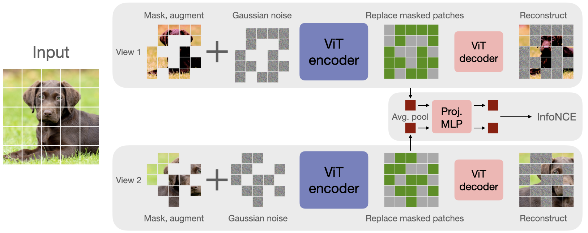

# CAN: A simple, efficient and scalable contrastive masked autoencoder for learning visual representations

Official PyTorch implementation of ["A simple, efficient and scalable contrastive masked autoencoder for learning visual representations"](https://arxiv.org/abs/2210.16870).

<p align="center">

</p>

- I have modified the code a little to test it on a user system using CPU on a small chest x-ray data set.s The original GitHub repository is: https://github.com/shlokk/mae-contrastive
  ---

## Table 1: File Connections and Tasks

| File Name             | Connected Files                                                   | Tasks                                                   |
|-----------------------|-------------------------------------------------------------------|--------------------------------------------------------|
| `engine_finetune.py`     | `main_finetune.py`, `main_linprobe.py`, `model_vit.py`                 | Fine-tuning loop, loss computation, metrics logging   |
| `engine_pretrain.py`     | `main_pretrain.py`, `model_vit.py`, `model_mae.py`, `loss_contrastive.py`, `util_contrastive.py` | Pre-training loop, MAE and contrastive loss computation, backward pass |
| `loss_contrastive.py`    | `engine_pretrain.py`, `util_contrastive.py`                           | Defines contrastive loss functions                     |
| `main_finetune.py`       | `engine_finetune.py`, `model_vit.py`                                  | Sets up fine-tuning, parses arguments, logging, loads dataset |
| `main_linprobe.py`       | `engine_finetune.py`, `model_vit.py`                                  | Linear probing on pre-trained features, argument parsing |
| `main_pretrain.py`       | `engine_pretrain.py`, `model_vit.py`, `model_mae.py`, `loss_contrastive.py`, `util_contrastive.py` | Entry point for pre-training, argument parsing, environment setup |
| `model_mae.py`           | `engine_pretrain.py`, `main_pretrain.py`                               | Defines MAE architecture based on ViT                 |
| `model_vit.py`           | `engine_pretrain.py`, `engine_finetune.py`, `main_pretrain.py`, `main_finetune.py`, `main_linprobe.py`, `model_mae.py` | Defines Vision Transformer (ViT) architecture |
| `submitit_finetune.py`   | `main_finetune.py`                                                  | Job submission for fine-tuning on cluster            |
| `submitit_linprobe.py`   | `main_linprobe.py`                                                  | Job submission for linear probing on cluster         |
| `submitit_pretrain.py`   | `main_pretrain.py`                                                  | Job submission for pre-training on cluster           |
| `util_contrastive.py`    | `engine_pretrain.py`, `loss_contrastive.py`                           | Utilities for contrastive loss, helper functions      |

---

## Table 2: File Dependencies and Versions

| File Name           | Libraries                                                                 | Versions                 |
|--------------------|---------------------------------------------------------------------------|--------------------------|
| `engine_finetune.py`  | torch, math, sys, typing, util.misc, util.lr_sched                         | works with any           |
| `engine_pretrain.py`  | torch, math, sys, typing, util.misc, util.lr_sched                         | works with any           |
| `loss_contrastive.py` | torch                                                                      | works with any           |
| `main_finetune.py`    | argparse, datetime, json, numpy, os, pathlib, torch, torchvision, timm, util.misc, util.pos_embed, util.lars, util.crop, models_vit, engine_finetune | timm==0.3.2, rest works with any |
| `main_linprobe.py`    | argparse, datetime, json, numpy, os, pathlib, torch, torchvision, timm, util.misc, util.pos_embed, util.lars, util.crop, models_vit, engine_finetune | timm==0.3.2, rest works with any |
| `main_pretrain.py`    | argparse, datetime, json, numpy, os, pathlib, torch, torchvision, timm, util.misc, util.pos_embed, util.lars, util.crop, models_vit, models_mae, loss_contrastive, util_contrastive, engine_pretrain | timm==0.3.2, rest works with any |
| `model_mae.py`        | torch, math, timm                                                         | works with any           |
| `model_vit.py`        | torch, math, timm                                                         | works with any           |
| `submitit_finetune.py`| argparse, os, uuid, pathlib, main_finetune, submitit                       | works with any           |
| `submitit_linprobe.py`| argparse, os, uuid, pathlib, main_linprobe, submitit                       | works with any           |
| `submitit_pretrain.py`| argparse, os, uuid, pathlib, main_pretrain, submitit                       | works with any           |
| `util_contrastive.py` | torch                                                                      | works with any           |

---

## Workflow Overview

### Pre-training Phase
```
main_pretrain.py → engine_pretrain.py → model_mae.py + model_vit.py + loss_contrastive.py → util_contrastive.py
```

### Fine-tuning Phase
```
main_finetune.py → engine_finetune.py → model_vit.py
```

### Linear Probing Phase
```
main_linprobe.py → engine_finetune.py → model_vit.py
```

### Submitit Scripts
```
submitit_pretrain.py → main_pretrain.py
submitit_finetune.py → main_finetune.py
submitit_linprobe.py → main_linprobe.py
```


## Requirements
- Instructions for creating conda enviroment. <br>


```
  conda env create -f can.yml
  conda activate can
```

## Instructions for running CAN <br>
```
git clone https://github.com/shlokk/mae-contrastive.git
cd mae-contrastive
```


Script for running CAN:

```
OMP_NUM_THREADS=1 python -m torch.distributed.launch --nproc_per_node=4 main_pretrain.py \
    --data_path path_to_imagenet --output_dir can_noise_baseline --log_dir can_baseline_logs \
    --num_workers 8 --blr 2.5e-4 --weight_decay 0.05 --model mae_vit_base_patch16 \
    --batch_size 64 --dist_url 'tcp://localhost:10004' --epochs 50 --weight_simclr 0.03 \ 
    --weight_mae 0.97 --accum_iter 4
```

Script for running MAE baseline:

```
OMP_NUM_THREADS=1 python -m torch.distributed.launch --nproc_per_node=4 main_pretrain.py \
    --data_path path_to_imagenet --output_dir mae_baseline --log_dir mae_baseline_logs \
    --num_workers 8 --blr 1.5e-4 --weight_decay 0.05 --model mae_vit_base_patch16 \
    --batch_size 64 --dist_url 'tcp://localhost:10004' --epochs 50 --weight_simclr 0 \
    --weight_mae 1.0 --accum_iter 4
```

Script for running linear evaluation:
```
OMP_NUM_THREADS=1 python -m torch.distributed.launch --nproc_per_node=4 main_linprobe.py \ 
    --data_path path_to_imagenet --batch_size 512 --model vit_base_patch16 --cls_token \
    --finetune can_noise_baseline/checkpoint-49.pth --epochs 90 --blr 0.1 --weight_decay 0.0 \
    --dist_eval --data_path  path_to_imagenet --output_dir mae_baseline_lineval
```
# Running CAN: Step-by-Step Instructions (on CPU)

## Step 1: Activate Environment
```bash
conda activate can
cd "path_to_mae-contrastive_directory"
```

## Step 2: Run Pretraining Script
```bash
python main_pretrain.py --data_path "path_to_dataset" \
                        --output_dir test_can_output \
                        --log_dir test_can_logs \
                        --batch_size 2 \
                        --epochs 1 \
                        --input_size 224 \
                        --num_workers 0 \
                        --device cpu
```

## Step 3: Create a Tiny Dataset (Optional)
```bash
python quick_chestxray.py
```

## Step 4: Verify Output
```bash
dir test_can_output
dir test_can_logs
```
**Expected output:**
- `.pth` checkpoint files in `test_can_output`
- TensorBoard logs in `test_can_logs`

## Step 5: Visualize Training Logs
```bash
tensorboard --logdir test_can_logs
```
Open the browser link (usually `http://localhost:6006`) to view metrics.

## Step 6: Run Linear Evaluation
```bash
python test_chestxray.py --checkpoint_path "test_can_output/checkpoint-0.pth"
```
**Expected output:**
```
Test Accuracy: 74.52%
Classification Report:
              precision    recall  f1-score   support
      NORMAL       0.93      0.35      0.50       234
   PNEUMONIA       0.72      0.98      0.83       390
    accuracy                           0.75       624
   macro avg       0.82      0.67      0.67       624
weighted avg       0.80      0.75      0.71       624
```


